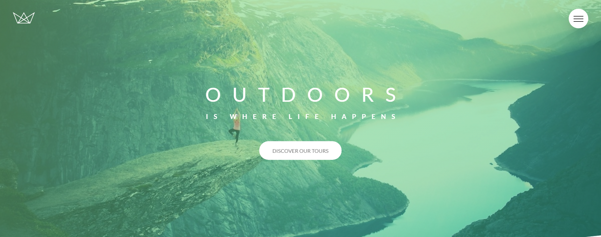
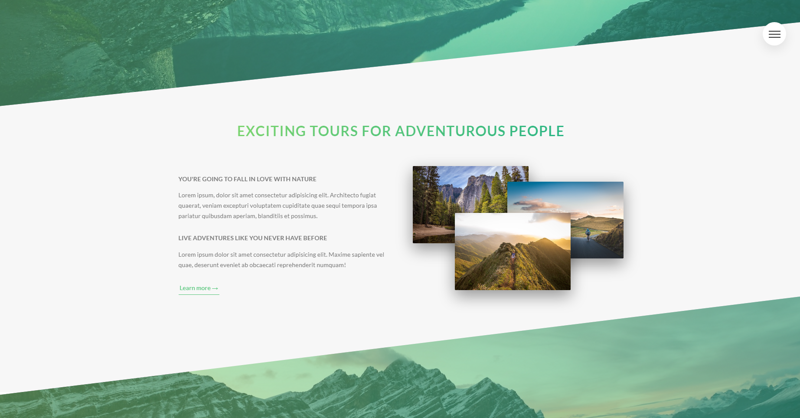
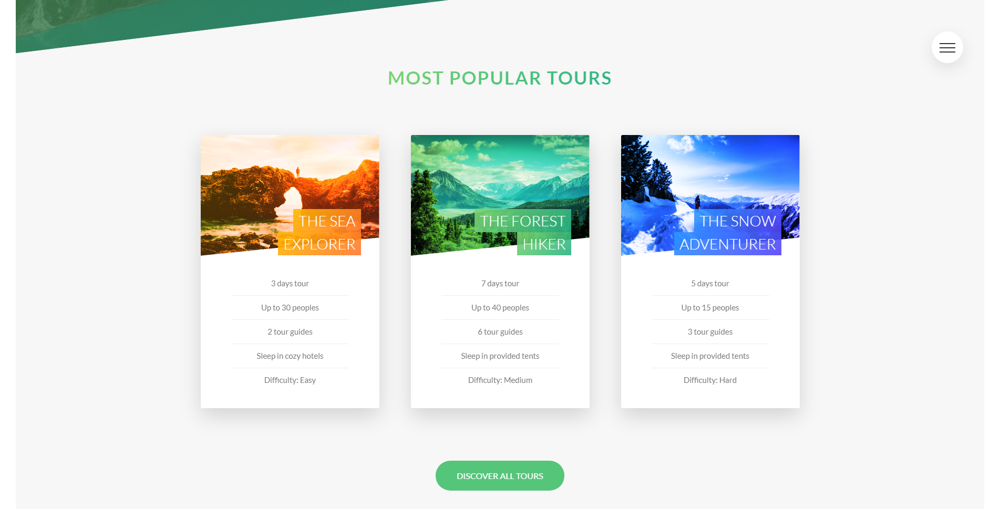

  

---

#### Natour is a fake Traveling agency website! You can see our different parcours selections. You are looking for a trip ? don't wait any longer!

---

## Table of contents

- [General info](#general-info)
- [Screenshots](#screenshots)
- [Technologies](#technologies)
- [Contact](#contact)

## General info

Project created during an advanced CSS course with the goal of teaching advanced styling method such as Sass, Home made Grid, Page being fully responsive as well.
I hope you will have as much fun looking at it as I had fun building it.

## Screenshots

  
  &nbsp; &nbsp;
  

## Technologies

## Contact

